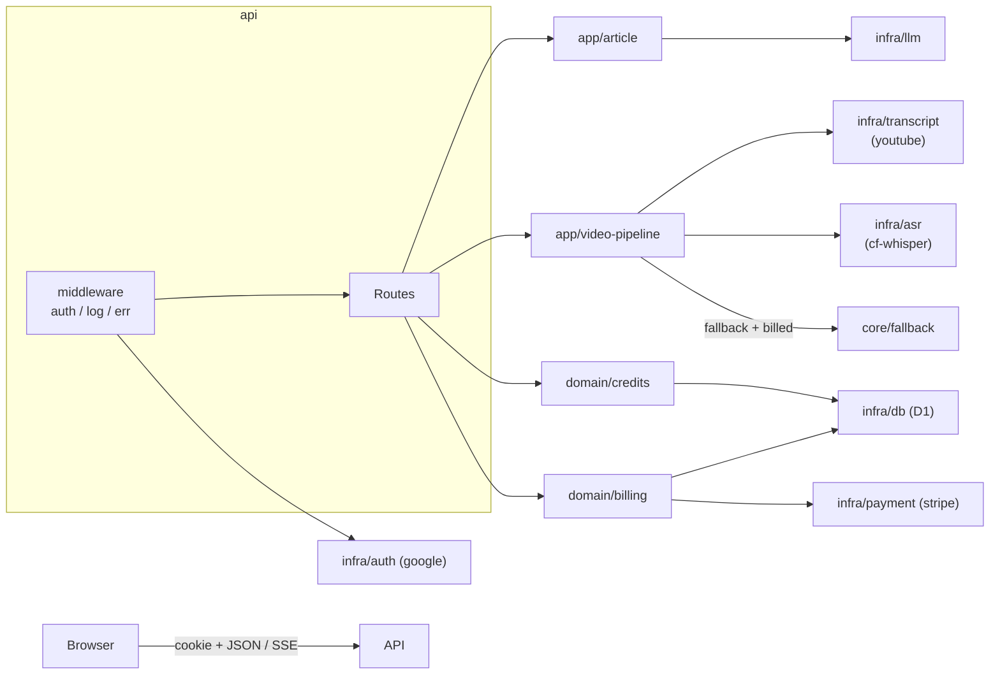
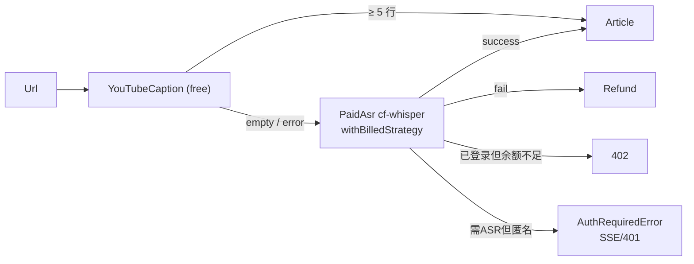

# Talk2Doc

把一个**有字幕的 YouTube 对话/访谈视频**，流式生成为一篇可读性极佳的**中文杂志体长文**。

- **为免费层而生**：抽 YouTube 字幕（JSON3）+ 一张 YouTube 自带的故事板 sprite（10×10 = 100 帧）作为输入，单次请求 ~10K token，是直接喂视频 URL 的 1/10 成本。
- **后端**：Cloudflare Workers + D1。整体按 `core / infra / domain / app / api / web` 六层组织，加新数据源/新模型/新业务只动一层。
- **模型**：开箱支持 **Gemini AI Studio**（免费）+ **DeepSeek**。
- **付费兜底**：无足够字幕时走 Cloudflare Workers AI Whisper，按分钟扣积分；ASR 失败自动退分。**未登录**也可先生成，仅当**必须**走 ASR 时才弹登录（付费转写以账户扣分为前提）。
- **账户体系**：Google OAuth 登录、注册赠送积分、Stripe 充值、订单/流水可查；充值/账单**必须**登录。
- **前端**：原生 ES Module，零框架；`marked` 走 jsDelivr CDN，`fetch` + `ReadableStream` + **rAF 字符级流式**渲染；登录态 / 余额胶囊 / 充值弹窗 / 402 引导一应俱全。
- **排版**：双层小标题 + `**发言人:**` 对话块，CSS `:has()` 自动识别加左侧引述线；单稿输出可发布版本。

## 架构

四层职责（参考 Google / Alibaba 工程规范，下沉基础、上浮编排）：

```
src/
  core/        通用工具（无业务）：fallback / billed-strategy / stream / json / log / id / hmac / cookie / jwt / template
  infra/       外部世界适配（无业务规则）：db(D1) / auth(google) / payment(stripe) / asr(cf-whisper) / llm / transcript
  domain/      纯业务（无 HTTP/IO）：users / credits / billing / pricing / asr-jobs / errors
  app/         业务编排（流式串接、多 provider 兜底）：article / video-pipeline
  api/         HTTP 入口：middleware/* + routes/*
  web/         前端：styles / auth / billing / app / index
prompts/       Markdown 提示词（build-time text import）
migrations/    D1 SQL 迁移
```



兜底链（transcript）：



`withBilledStrategy(strategy, costFn)` 把"扣分→跑→失败回滚/退分"封进装饰器。`runWithFallback` 仍然只关心成功/失败，扣分逻辑解耦。`InsufficientCreditsError` 与 `AuthRequiredError` 都通过 `fatal` 外抛，前者在 HTTP/流式中翻 402 或 `credits_insufficient`，后者翻 401 或 `auth_required`（提示登录后再用 ASR）。

## 关键流程

**两阶段写稿**：

1. **角色识别**（非流式，结构化 JSON）：先从字幕首尾 + 中段抽样推断参与者真实姓名与角色；具备 vision 时把 10×10 sprite 一并送入。失败自动退化为占位身份，不阻塞主流程。
2. **正文撰写**（流式）：把 manifest 作为"权威发言人名单"注入正文 prompt，输出可发布版本。

**生成请求生命周期**（`POST /api/generate`）：

```
withAuth（有 cookie 则带 currentUser；匿名可进来）
   │
   └─→ VideoPipeline.run
         ├─ YouTubeProvider.extract     (free，匿名/登录均可)
         └─ 需 ASR 时：
              ├─ 匿名     → AuthRequiredError ── SSE error auth_required 弹「登录以转写」
              ├─ 已登录  → withBilledStrategy (charge → ASR → ok / refund)
              │            └─ InsufficientCreditsError ── 402 / credits_insufficient 弹充值
   │
   └─→ ArticleAgent.run                 ── SSE: status / chunk / error / done
```

## 项目结构

```
src/
├── index.ts                     Worker 入口（路由表 + 中间件链）
├── core/
│   ├── fallback.ts              A/B/C 策略兜底（含 fatal 钩子）
│   ├── billed-strategy.ts       策略装饰器：扣分→跑→退分
│   ├── stream.ts / json.ts      通用流 / 容错 JSON
│   ├── log.ts / id.ts           结构化日志 / UUID
│   ├── hmac.ts / jwt.ts / cookie.ts   Web Crypto 工具（无 SDK）
│   └── template.ts              MD 提示词 {{var}} 插值
├── infra/
│   ├── config.ts                env → AppConfig（一处加载）
│   ├── db/d1.ts                 D1 first/all/exec/batch
│   ├── auth/                    google-oauth.ts + session.ts
│   ├── payment/stripe.ts        Checkout + Webhook 验签（无 SDK）
│   ├── asr/                     types / cf-whisper / stub
│   ├── llm/                     types / index / gemini / openai(DeepSeek 兼容实现)
│   └── transcript/              types / index / asr / youtube/*
├── domain/
│   ├── types.ts                 User / CreditTx / BillingOrder / AsrJob
│   ├── errors.ts                AuthRequiredError（等）
│   ├── pricing.ts               一处定价 + 套餐解析
│   ├── credits.ts               charge / refund / getBalance / history
│   ├── users.ts                 upsertFromGoogle + 注册赠送
│   ├── billing.ts               createPendingOrder / markPaid（幂等）
│   └── asr-jobs.ts              ASR 任务审计
├── app/
│   ├── video-pipeline.ts        免费字幕 → 付费 ASR 兜底主干
│   └── article/
│       ├── article-agent.ts     两阶段编排（speaker-id → 可发布版本）
│       ├── speaker-id.ts        阶段 1
│       └── prompts/index.ts     从 prompts/*.md import + 占位填充
├── api/
│   ├── context.ts               每请求 service container
│   ├── router.ts                极简路由
│   ├── respond.ts               json / err / redirect
│   ├── sse.ts                   SSE 编码 + 上游拆帧
│   ├── middleware/              auth / err / log
│   └── routes/                  auth / pricing / billing / generate
├── web/
│   ├── styles.ts                CSS（含登录区/弹窗/文章视图）
│   ├── auth.ts                  顶栏鉴权区骨架
│   ├── billing.ts               充值弹窗骨架
│   ├── app.ts                   客户端脚本（SSE / rAF / 充值流）
│   └── index.ts                 组装 INDEX_HTML
prompts/                         article.publish.md / speaker-id.system.md / few-shot.md
migrations/                      0001_init.sql（users / credit_transactions / billing_orders / asr_jobs）
tests/                           smoke-credits / smoke-asr-fallback / smoke-youtube / smoke-agent
```

## 一键部署

需要：Node 18+、Cloudflare 账号、（可选）一把免费 Gemini Key。

### 0. 安装依赖

```bash
npm install
npx wrangler login
```

### 1. 创建 D1 数据库

```bash
npm run db:create
# → 终端输出 database_id，复制到 wrangler.toml 的 [[d1_databases]] 下
npm run db:migrate:remote
```

### 2. 配置 secrets（生产）

```bash
npx wrangler secret put GEMINI_API_KEY        # 任选其一或都配
npx wrangler secret put DEEPSEEK_API_KEY
npx wrangler secret put SESSION_SECRET        # 64 字节随机串
npx wrangler secret put GOOGLE_CLIENT_ID
npx wrangler secret put GOOGLE_CLIENT_SECRET
npx wrangler secret put STRIPE_SECRET_KEY
npx wrangler secret put STRIPE_WEBHOOK_SECRET
```

非敏感参数直接编辑 `wrangler.toml [vars]`：`APP_BASE_URL`、`PRICING_PER_MINUTE_CREDITS`、`SIGNUP_BONUS_CREDITS`、`TOPUP_PACKAGES_JSON`、`GEMINI_MODEL`、`DEFAULT_LLM_PROVIDER`。

### 3. 部署

```bash
npm run deploy
```

部署完终端输出可访问 URL：

```
https://talk2doc.<your-subdomain>.workers.dev
```

把这个域名加到：
- Google Cloud OAuth → 已授权重定向 URI：`<URL>/api/auth/google/callback`
- Stripe Dashboard → Webhooks 端点：`<URL>/api/billing/stripe-webhook`，订阅 `checkout.session.completed`

## 本地开发

```bash
cp .dev.vars.example .dev.vars
# 把 GEMINI_API_KEY / DEEPSEEK_API_KEY / SESSION_SECRET 等填进去
npm run db:migrate:local
npm run dev
# 打开 http://localhost:8787
```

`.dev.vars` 已被 `.gitignore` 忽略。`SESSION_SECRET` 可以本地随便写，生产请用 `openssl rand -hex 32`。

## 测试

```bash
npm test                    # 跑 credits + asr-fallback 两组冒烟
npm run test:credits        # 注册赠送 / charge / refund / Stripe 幂等
npm run test:asr            # 含：匿名+字幕成 / 匿名+需ASR 抛 AuthRequired / 余额不足 等
npm run test:youtube        # 真实网络：字幕 + 故事板抽取
npm run test:agent          # 真实网络：端到端 LLM 流（需 LLM_API_KEY）
```

冒烟测试用内存 SQLite（`better-sqlite3`）模拟 D1，不打网络、不写文件，跑一遍 < 5 秒。

## 使用

1. **未登录也能直接生成**（有可用字幕的公开视频，走免费字幕 + LLM，无需账户）。
2. 打开页面，粘贴 YouTube 链接。有**足够字幕**时最省；**无足够字幕**时会提示**登录**后用积分做付费转写（不静默扣费）。
3. 需要**充值、账单、余额**时，点 **Sign in with Google** 登录（首登赠送等见 `wrangler.toml`）。
4. 点 **生成**。若走免费路径会显示「已使用免费字幕（… 行）」；登录后走 ASR 会显示扣积分与余额。匿名且需要转写时弹**登录**引导；**积分不足**则弹**充值**。
5. 文章生成后直接展示**可发布版本**；展开 **高级** 可改 provider（Gemini/DeepSeek）、模型与 API Key（仅本机 `localStorage`）。

## 设计取舍

- **D1 而非 KV**：账单天然要事务、要范围查询和外键。D1 `batch()` 一次跑完"扣分 + 写流水 + 更新余额"，原子且简单。
- **不引 Stripe SDK**：Worker 体积敏感。`createCheckoutSession` 走 REST + URL-encoded form；`verifyWebhookSignature` 用 Web Crypto 自实现 HMAC-SHA256，社区标准做法，单文件 < 200 行。
- **prompt 用 build-time MD import 而非 fetch**：Worker 没有 fs，运行时拉远程 MD 既慢又脆。`[[rules]] type="Text"` 在打包时把 MD 内联为字符串，零运行时成本。
- **扣分用策略装饰器而非 strategy 内部塞业务**：`runWithFallback` 不关心成本、`PaidAsrStrategy` 不关心计费，`withBilledStrategy` 把"业务规则"和"技术执行"解耦，将来叠加 quota / rate-limit / 限频装饰器都是这个口子。
- **`InsufficientCreditsError` 走 fatal 而非吞错继续兜底**：兜底是为了"换一种技术手段"，余额不足是用户决策问题；fatal 钩子翻 402。
- **`AuthRequiredError` 走 fatal**：需付费 ASR 但无登录态，不应吞错到别的技术兜底；在 SSE/HTTP 中告诉前端"先登录"。免费字幕路径不触发。
- **InnerTube ANDROID 客户端**：直接 POST `youtubei/v1/player`，不刮 HTML、不需要 PoT token；WEB 客户端 2024 起对 timedtext 加了软封，ANDROID 路径目前依然干净。
- **JSON3 字幕格式**：caption baseUrl 默认 srv3 XML，强制 `&fmt=json3` 拿到的事件天然是逐句切分。
- **故事板 = 天然 sprite**：YouTube 自带 `storyboard3_L0/default.jpg`，10×10 = 100 帧约 32KB，一个 URL 直拿，不需要 ffmpeg。
- **rAF 字符级流式**：每 token 到达 ≤16ms 内显示，同帧多 token 合并一次 `marked.parse`，60fps 上限避免 jank。
- **API Key 双通道**：默认走 `wrangler secret`，前端可填覆盖（仅 `localStorage`）；适合私有部署也适合 Demo 分享。
- **Sprite 优雅降级 ×2**：① 故事板抽取失败时退回纯字幕模式。② 选了纯文本模型（DeepSeek-V3 / DeepSeek-R1 / GPT-3.5 / o1-mini）时，agent 基于 `LLMAdapter.supportsVision()` 不传 image_url、prompt 也同步切到纯字幕语境，避免提示与入参不一致。

## 已知局限

- 不支持私有/会员/年龄限制视频。
- 单个 IP 字幕请求过密集时 YouTube 可能短时限流；生产建议挂一层 KV 缓存。
- ANDROID InnerTube key/version 长期稳定，万一被换，更新 `src/infra/transcript/youtube/innertube.ts` 顶部两个常量即可。
- Cloudflare Workers AI Whisper 单次入参有大小限制，超过 30 分钟视频可能需要分段（`infra/asr/cf-whisper.ts` 留了 hook）。
- 不接 Cloudflare AI Gateway：Gateway 已知会缓冲 Gemini 流，直连保证真流式。

## 许可

MIT
